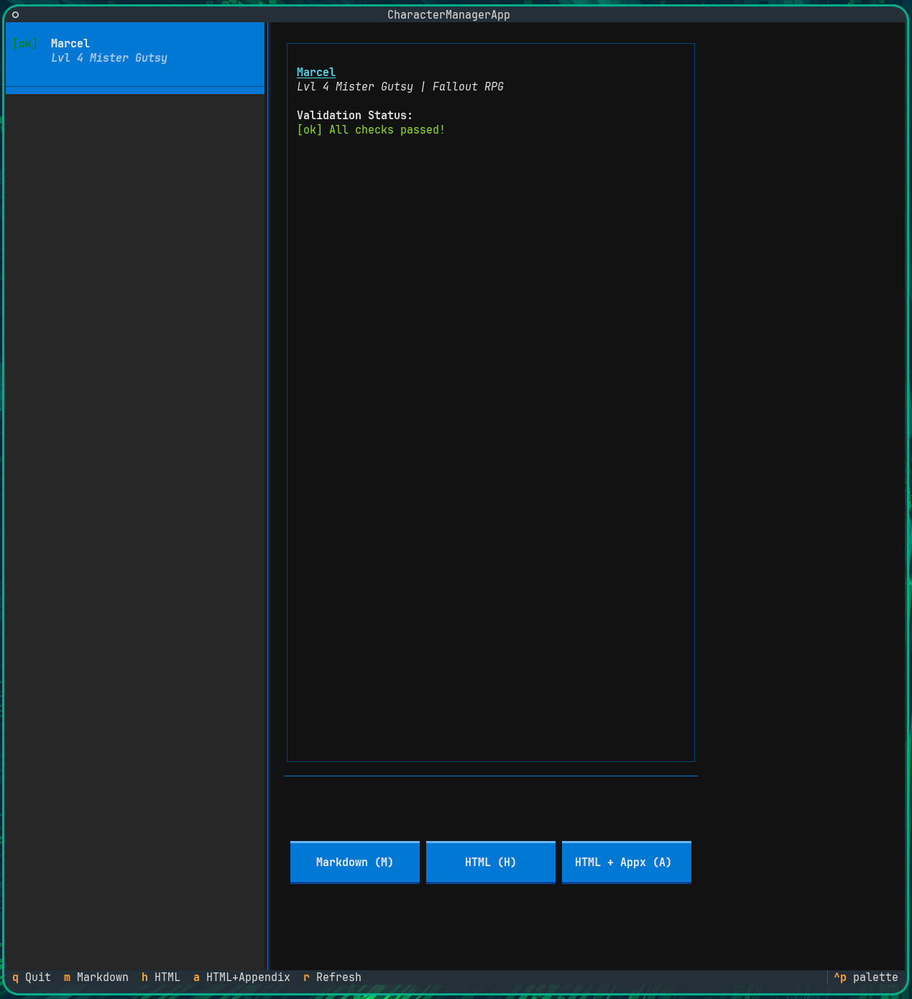

# RPG Sheets

Offline character sheet generator for tabletop RPGs. Currently supports **Fallout: The Roleplaying Game** (2d20 system) via FoundryVTT exports.



## Quick Start

```bash
git clone https://github.com/hnsstrk/fallout_char_mngt.git
cd fallout_char_mngt
pip install -r requirements.txt
python rpg_sheets.py
```

## Features

- **Interactive TUI** - Browse characters, view validation status, generate sheets
- **Multiple output formats** - Markdown, HTML (print-optimized), HTML with appendix
- **Automatic calculations** - Derived stats calculated from validated formulas
- **Validation** - Schema checks, data health, completeness reports
- **Extensible** - Plugin architecture for future RPG systems

## Usage

```bash
python rpg_sheets.py
```

| Key | Action |
|-----|--------|
| `M` | Generate Markdown sheet |
| `H` | Generate HTML sheet |
| `A` | Generate HTML with skill appendix |
| `R` | Refresh character list |
| `Q` | Quit |

### Adding Characters

1. Export character from FoundryVTT (Right-click → Export Data)
2. Save JSON file to `fvtt_export/` directory
3. Press `R` to refresh the character list

### Output

Generated sheets are saved to `character_sheets/`. HTML files can be printed to PDF via browser (Ctrl+P).

## Supported Systems

| System | Source | Status |
|--------|--------|--------|
| Fallout 2d20 | FoundryVTT | Supported |

## Requirements

- Python 3.6+
- Dependencies: `textual`, `jinja2` (via `pip install -r requirements.txt`)

### Virtual Environment (Recommended)

```bash
python -m venv venv
source venv/bin/activate  # Linux/macOS
# or: .\venv\Scripts\Activate.ps1  # Windows PowerShell
pip install -r requirements.txt
```

## License & Attribution

**For personal/group offline play only.** Not for commercial distribution.

- **Fallout: The Roleplaying Game** - Modiphius Entertainment
- **Fallout IP** - Bethesda Softworks LLC
- **FoundryVTT Fallout System** - Muttley and contributors

See [`reference_data/SOURCE.md`](./reference_data/SOURCE.md) for complete licensing.

**Disclaimer**: Fan-made tool for personal use. Not affiliated with Modiphius, Bethesda, or Foundry Gaming.

---

*For the wasteland, prepared. For offline play, ready.*
