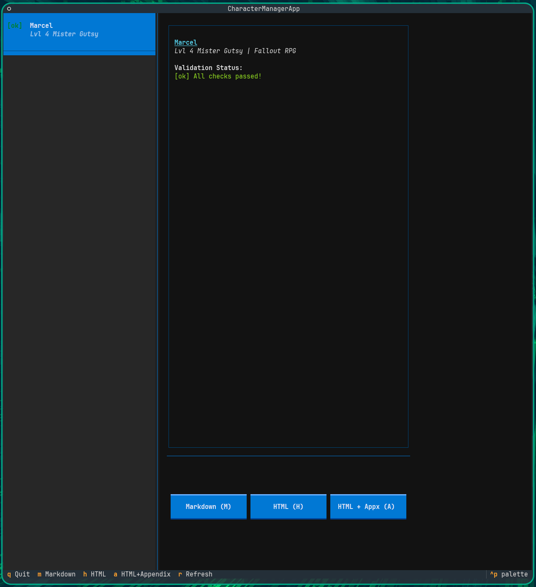

# RPG Sheets

Offline character sheet generator for tabletop RPGs. Currently supports **Fallout: The Roleplaying Game** (2d20 system) via FoundryVTT exports.



## Quick Start

```bash
git clone https://github.com/hnsstrk/fallout_char_mngt.git
cd fallout_char_mngt
pip install -r requirements.txt
python rpg_sheets.py
```

## Features

- **Interactive TUI** - Browse characters, view validation status, generate sheets
- **Multiple output formats** - Markdown, HTML (print-optimized), HTML with appendix
- **Automatic calculations** - Derived stats calculated from validated formulas
- **Validation** - Schema checks, data health, completeness reports
- **Extensible** - Plugin architecture for future RPG systems

## Usage

```bash
python rpg_sheets.py
```

| Key | Action |
|-----|--------|
| `M` | Generate Markdown sheet |
| `H` | Generate HTML sheet |
| `A` | Generate HTML with skill appendix |
| `R` | Refresh character list |
| `O` | Open the last export if it is HTML |
| `Q` | Quit |

### Adding Characters

1. Export character from FoundryVTT (Right-click → Export Data)
2. Save JSON file to `fvtt_export/` directory
3. Press `R` to refresh the character list

### Output

Generated sheets are saved to `character_sheets/` next to the script. Their names contain a short key derived from the source filename, so equally named actors do not overwrite each other; HTML with skill appendix has its own `-appendix.html` filename. If a sheet already exists, the TUI asks before replacing it. The saved path remains visible; press `O` to open it if the last export is HTML. For Markdown, use the displayed path. HTML files can then be printed to PDF via your browser's print dialog. Files that fail to load are shown in the list but cannot be generated. Validation health warnings do not prevent export; check the sheet before printing.

### Command line

From the repository root, you can generate a single sheet without the TUI or validate an export:

```bash
python -m lib.fallout_sheet_generator fvtt_export/fvtt-Actor-marcel-O44zYNGmMfYtSjVw.json --format html
python -m lib.fallout_character_validator fvtt_export/fvtt-Actor-marcel-O44zYNGmMfYtSjVw.json
python -m unittest discover -v
```

The generator also accepts `--format markdown` (the default) and `--appendix` with HTML. Source JSON files must be inside this repository's `fvtt_export/`; generated files are written to its `character_sheets/`. The CLI refuses to replace an existing sheet unless you pass `--replace`. You can pass an absolute path to an export when calling the CLI from another directory.

## Supported Systems

| System | Source | Status |
|--------|--------|--------|
| Fallout 2d20 | FoundryVTT | Supported |

## Requirements

- Python 3.9+
- Dependencies: `textual`, `jinja2` (via `pip install -r requirements.txt`)

### Virtual Environment (Recommended)

```bash
python -m venv venv
source venv/bin/activate  # Linux/macOS
# or: .\venv\Scripts\Activate.ps1  # Windows PowerShell
pip install -r requirements.txt
```

## License & Attribution

**For personal/group offline play only.** Not for commercial distribution.

- **Fallout: The Roleplaying Game** - Modiphius Entertainment
- **Fallout IP** - Bethesda Softworks LLC
- **FoundryVTT Fallout System** - Muttley and contributors

See [`reference_data/SOURCE.md`](./reference_data/SOURCE.md) for complete licensing.

**Disclaimer**: Fan-made tool for personal use. Not affiliated with Modiphius, Bethesda, or Foundry Gaming.

---

*For the wasteland, prepared. For offline play, ready.*
